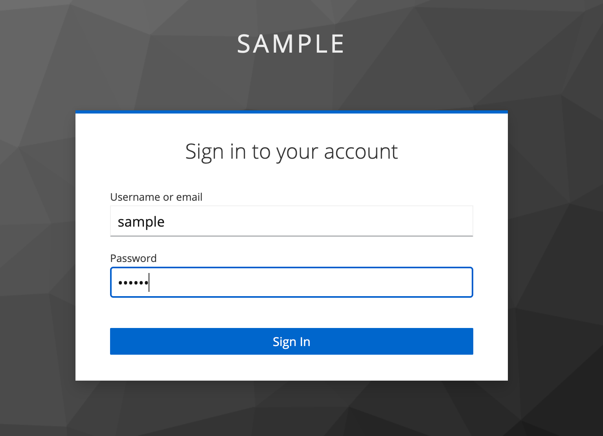
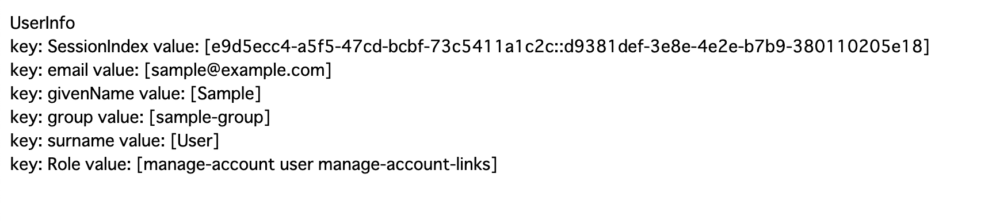

# go-keycloak-example

## Requirements

- Go
- Docker
- docker compose

## Run

1. Run current command in terminal-1.

    ```
    $ make up
    ```

1. Run current command in terminal-2.

    ```
    $ make run-saml
    ```

1. Access to http:localhost:8000/hello

    You will be redirected to http://localhost:8080/realms/sample/protocol/saml and login with the following user:

    - user: sample
    - password: sample

    

1. Logged-in user information will be displayed.

    
